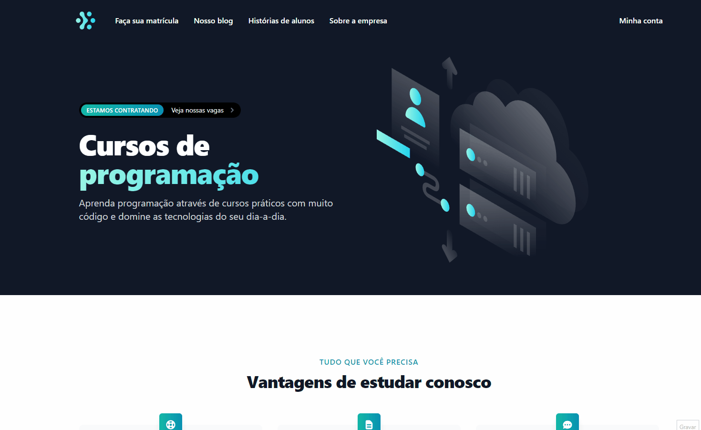

<h4 align="center">
    Sua plataforma de cursos
</h4>

  <a href="#rocket-technologies">Technologies</a>

<h4 align="center">
  Demo
</h4>

  

## :rocket: Technologies

This project was developed with the following technologies:

- [NestJS](https://nestjs.com/)
- [Kafka](https://kafka.apache.org/)
- [GraphQL](https://graphql.org/)
- [Auth0](https://auth0.com/)
- [Apollo](https://www.apollographql.com/docs/federation/)
- [Prisma](https://www.prisma.io/)
- [Typescript](https://www.typescriptlang.org/)

- [Next.js](https://nextjs.org/)
- [Tailwind](https://tailwindcss.com/)

- [PostgresSQL](https://www.postgresql.org/)
- [Docker](https://www.docker.com/)

Made with ❤ [Igor Marchi](https://www.linkedin.com/in/igor-marchi/) :laughing:
